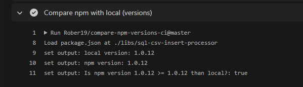

# Compare a npm package version with your package.json

[](https://actions-badge.atrox.dev/Rober19/compare-npm-versions-ci/goto?ref=master)

Output shows up if the already latest version of X npm package is `>=` to local one :



This is a good example for using this package ; )

```yml
name: Publish

# Run this workflow every time a new commit pushed to your repository
on:
  pull_request:
    branches:
      - npm-publish
  push:
    branches:
      - npm-publish

defaults:
  run:
    working-directory: libs/sql-csv-insert-processor

jobs:
  release:
    name: Release
    runs-on: ubuntu-latest
    steps:
      - name: Checkout repository
        uses: actions/checkout@v2
        with:
          fetch-depth: '0'
      # ----------------------------------------------------
      - name: Set up Node.js
        uses: actions/setup-node@master
        with:
          node-version: 12.x
          registry-url: 'https://registry.npmjs.org/'
      # ----------------------------------------------------
      - name: Compare npm with local (versions)
        uses: Rober19/compare-npm-versions-ci@master
        id: package_version
        with:
          path: './libs/sql-csv-insert-processor'
          npm_package_name: sql-csv-insert-processor
      # ----------------------------------------------------
      - name: Get version
        run: |
          echo "Version is  ${{ steps.package_version.outputs.version }} "    
          echo "Version NPM is  ${{ steps.package_version.outputs.pkg_npm_version }} "
      # ----------------------------------------------------
      - name: Version Issue
        if: steps.package_version.outputs.npm_is_greater == 'true'
        run: |
          echo "Package will not be deployed due to version number must increase"
      # ----------------------------------------------------
      - name: Publish
        if: steps.package_version.outputs.npm_is_greater == 'false'
        uses: JS-DevTools/npm-publish@v1
        with:
          token: ${{ secrets.NPM_ACCESS_TOKEN_PUBLISH }}
          package: ./libs/sql-csv-insert-processor/package.json
      # ----------------------------------------------------
```

Console output example

```bash

echo "Version is 1.0.12"
echo "Version NPM is 1.0.11"

```
